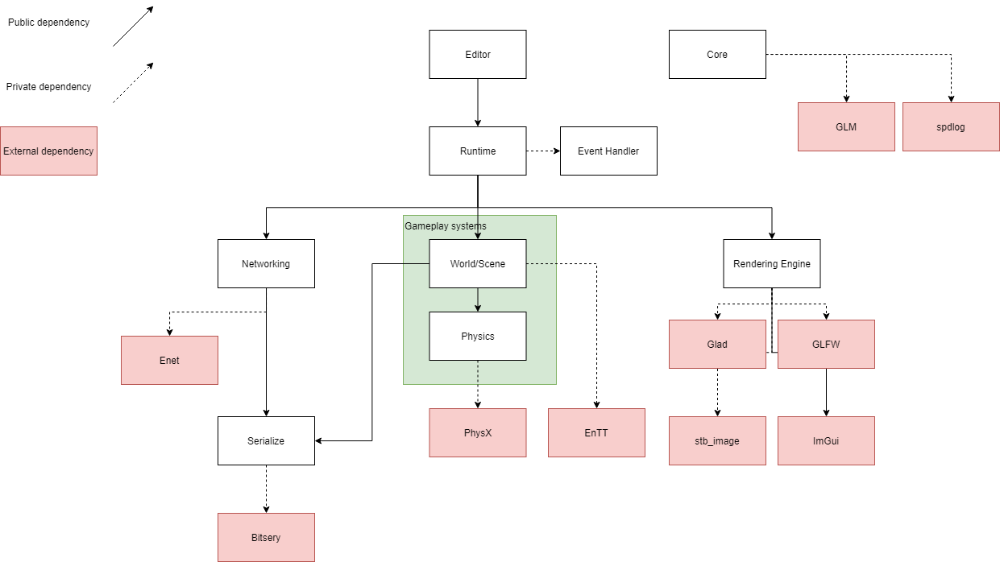

# Aphelion Engine
> I am redesigning this engine with support to target WebGL. See it [here (AphelionWeb)](https://github.com/antjowie/AphelionWeb)

A cross platform game engine written, made as an educational passion project.  
You can follow the development of this project on the [Trello page](https://trello.com/b/XO0iYUhz/voxelcraft)

## Features



## Purpose
One of the first things that I wanted to do when I started learning programming was to create a game engine. With my experiences right now, I feel confident to pick up this task.

Ultimately, I want to find out where my interest truly lies. Alongside this project I will make a Minecraft clone called VoxelCraft to focus on implementing things that actually are needed. At the time of writing this, I'm interested in networking and graphics, so those two will be the main priority of this project (hence why I'm making a Minecraft clone with multiplayer support).

I do not intend to compete with existing software. This is also quite a large project that I plan to work on for quite a while. At last, it is meant as an educational project.

## Build instructions
The project makes use of CMake so building should be straightforward. Simply do the following in a command prompt/terminal (on Windows):
> NOTE: As of right now, the project can't be build as a DLL. The engine defines the entry point (this is because last I remembered it was necessary for DirectX to retrieve some parameters in the entry function). It contains a function declaration that the user defines in their project file. Because of this, the engine library can't compile 

```
git clone https://github.com/antjowie/Aphelion-engine.git aphelion-engine
cd aphelion-engine

cmake -S . -B build
cmake --build build
```
The project makes use of submodules, but they are automatically pulled if `GIT_SUBMODULE` is on.

> **[Important]** To copy files to the output directory, build all targets. CMake is set up to copy all needed resources when building all targets. I have yet to figure out a better way of doing this.

## Credits
There are a lot of libraries and resources that I'm reading from. I'll try to keep a list of them here:
* This project heavily references [The Cherno his game engine series](https://www.youtube.com/playlist?list=PLlrATfBNZ98dC-V-N3m0Go4deliWHPFwT). It has given me some great insights on API design which I've taken much inspiration from.
* Open-builder. One of the inspirations that made me start this project.
